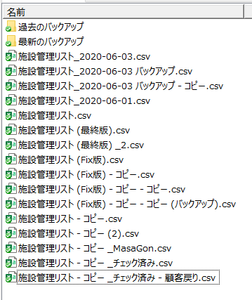
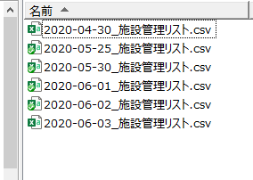
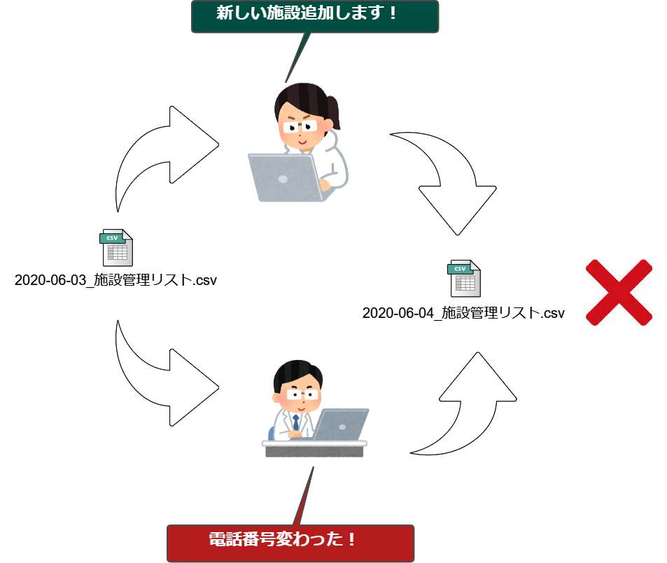
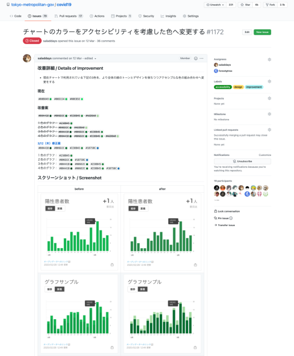
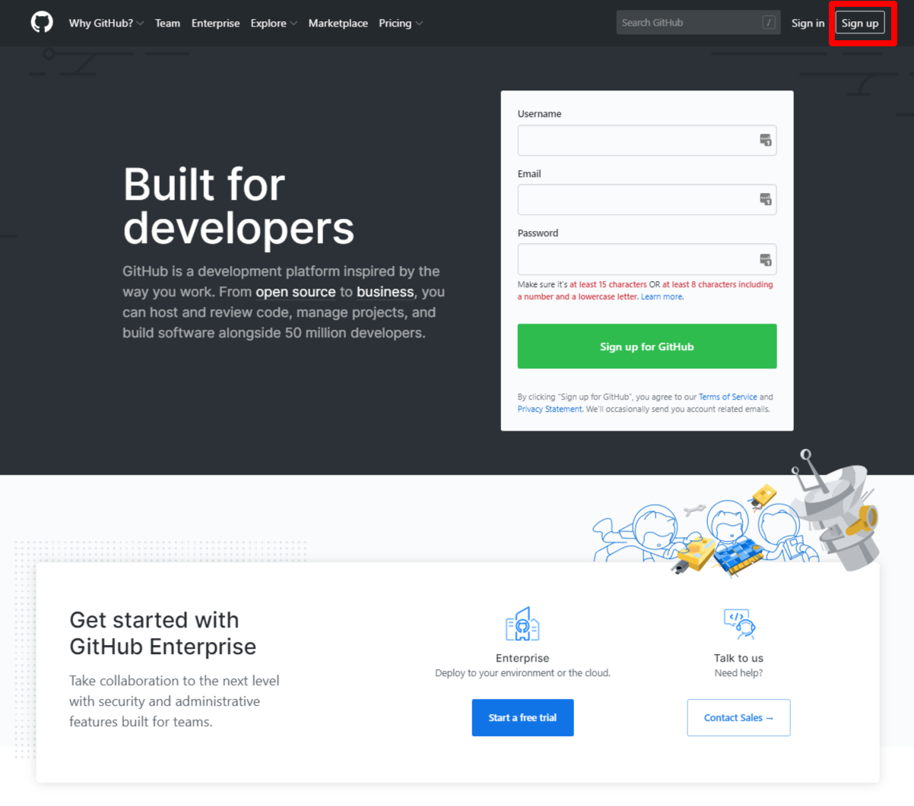
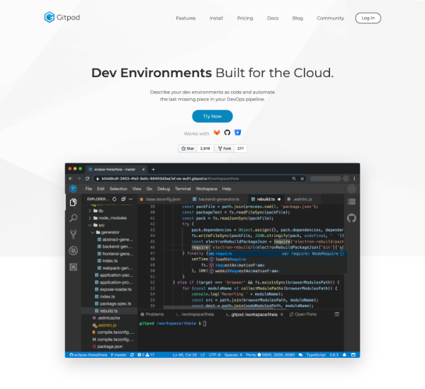

# GitHub入門講座

---

## 本日のメニュー

### 導入篇

    1. GitHubってなに？
    2. 東京都のCovid19サイトではどうやって使ってる？

### ハンズオン編

    1. GitHubにログイン
    2. Forkしてみよう
    3. Gitpodで立ち上げよう
    4. ブランチを作ろう
    5. 編集してCommitしてみよう
    6. プルリクを出してみよう

---

## 導入編

### 1. GitHubってなに

---

#### Git と GitHub

- 混同するとネットで怒られるやつ (Wiki vs WikiPedia)

##### Git

    - ソースコードなどの変更履歴を記録・追跡するための分散型「バージョン管理システム」つまり「ツール名」
    - Linuxの開発者のリーナスさん（えらい人）が作った

##### GitHub

    - 開発者のための「プラットフォーム」つまり「サービスの名前」
    - 中でGitが動いている (Gitのためのハブ)

---

#### なぜバージョン管理が必要なのか？

---

#### よく見る光景

あなたのフォルダー、こんな感じですよね？

---

#### フォルダー見といて！

どれみればいいねん！

---

#### だいぶ良くなった？

- 日付の桁数も揃ってる
- 名前でソートすれば日付順に揃う

---

#### 衝突！

俺の修正どこ行った？！

---

#### バージョン管理システムに求められる要件

- ファイルの変更の履歴が記録される（いつ、だれが、どこを、どんなふうに）
- 間違って変更したら直ぐに元に戻せる
- 複数人で管理して衝突してもどちらかが泣くことがない
- いつでも立ち戻って確認が出来る
- ファイル単位ではなく、行単位、文字単位で差分がわかる

---

#### 全部出来るさ！

そう、GitHubならね！

---

## 導入編

### 2. 東京都のCovid19サイトではどうやって使ってる？

---

#### 東京都新型コロナ感染症対策サイト

---

#### 話題になったアクセシビリティのissue
https://github.com/tokyo-metropolitan-gov/covid19/issues/1172

---

## ハンズオン編

---

## ハンズオン編

### 1. GitHubにログイン

- GitHubアカウントを作ります。
- アカウント登録にはメールアドレスが必要です。登録は無料です。
- https://github.com/join?ref_cta=Sign+up&ref_loc=header+logged+out&ref_page=%2F&source=header-home

---

## ハンズオン編

### 2. Forkしてみよう

- フォーク先は自分のユーザー名の配下です。

---

## ハンズオン編

### 3. Gitpodで立ち上げよう

- GitHubやGitLabなどと統合可能なクラウドIDE（統合開発環境）です。
- 今回はコマンドラインからの操作は極力避けるために、こちらを使います。
- 月50時間の利用まで無償で使うことができます。
- https://www.gitpod.io/

---

## ハンズオン編

### 4. ブランチを切ろう

- masterブランチで作業しても大丈夫ですが、お作法的に新規ブランチを切ったほうがなにかといいです。
- ブランチ名は `feature/***` とディレクトリを切るやり方が一般的です。

---

## ハンズオン編

### 5. 編集してCommitしてみよう

- Markdownで「自己紹介スライド」を作りましょう。
- コミットメッセージを入力して、先ほど切ったブランチにコミットしましょう。
- 自分のGitHubにPushしましょう。

---

## ハンズオン編

### 7. プルリクを出してみよう

- プルリクとは、Pull Requestのこと。自分の編集を本家に取り込んでもらうためのお願いです。
- レポジトリーのオーナーでなくても、GitHubのアカウントを持っていれば誰でもリクエストできます。

※参加者の皆さんの作業はここまでです。お疲れ様でした！

---

## ハンズオン編

### 8. Mergeします

- Mergeとは、皆さんからのプリリクを本家に取り込む作業です。
- レポジトリーのオーナのみが実行できます。
- CfJのスタッフがみなさんのプルリクをマージします。

※ハンズオンは以上です。お疲れ様でした！
